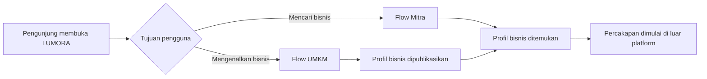
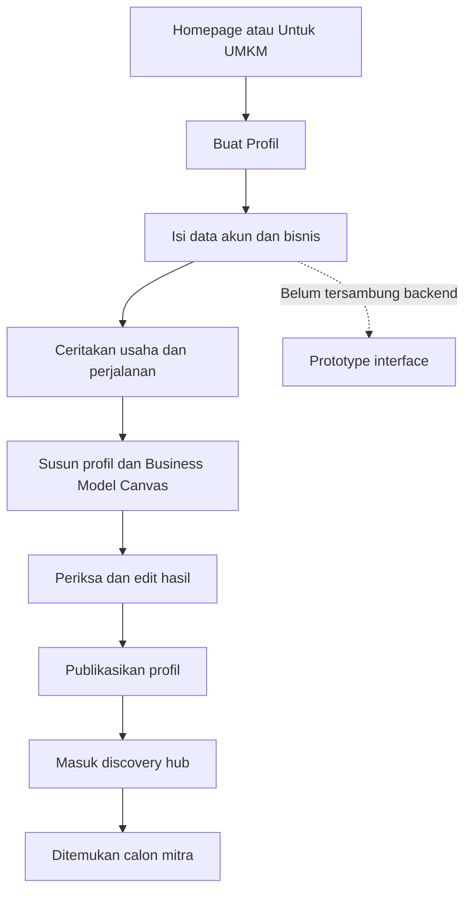
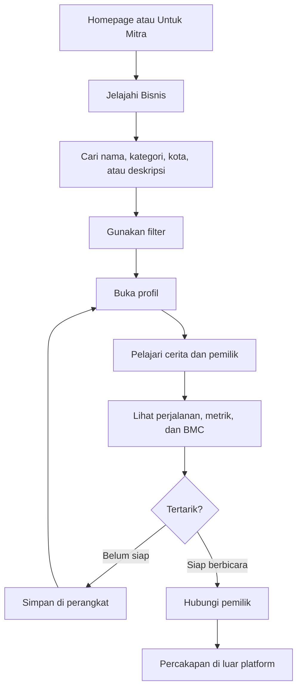
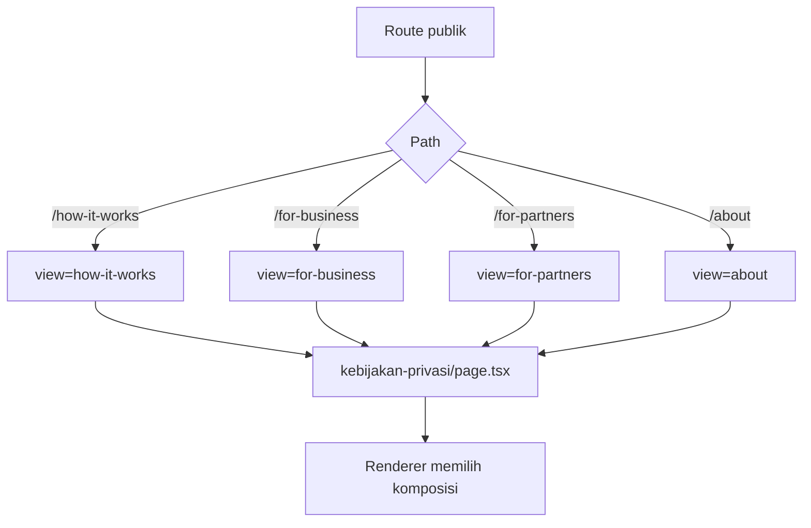
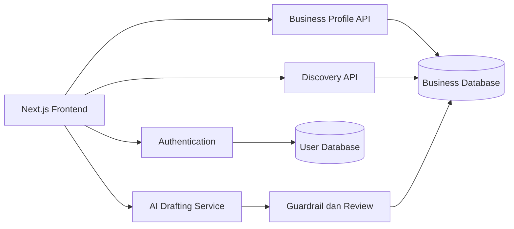

# LUMORA

**Digital Pitching + Business Discovery Platform untuk UMKM Indonesia.**

LUMORA membantu pemilik UMKM menyusun cerita, perjalanan, data sederhana, dan model bisnisnya menjadi profil digital yang mudah dipahami. Calon mitra dapat menemukan, mempelajari, menyimpan, lalu memulai percakapan dengan bisnis yang relevan.

> Status: **frontend prototype / MVP interface**. Seluruh profil dan metrik bisnis merupakan data contoh. Autentikasi, database, penyimpanan akun, AI production, dan pengiriman pesan belum terhubung ke backend.

---

## Daftar Isi

- [Tujuan Produk](#tujuan-produk)
- [Fitur](#fitur)
- [Flow Produk](#flow-produk)
- [Route](#route)
- [Teknologi](#teknologi)
- [Menjalankan Proyek](#menjalankan-proyek)
- [Struktur Frontend](#struktur-frontend)
- [Arsitektur](#arsitektur)
- [Data dan State](#data-dan-state)
- [Design System](#design-system)
- [SEO dan Aksesibilitas](#seo-dan-aksesibilitas)
- [Batasan MVP](#batasan-mvp)
- [Arah Pengembangan](#arah-pengembangan)

## Tujuan Produk

LUMORA menjembatani dua kebutuhan utama.

### Untuk UMKM

- Menyusun informasi usaha secara bertahap.
- Mengubah cerita sederhana menjadi profil terstruktur.
- Mendokumentasikan milestone perjalanan usaha.
- Menampilkan Business Model Canvas.
- Menjelaskan kebutuhan kemitraan.
- Membuat bisnis lebih mudah ditemukan.

### Untuk calon mitra

- Menjelajahi bisnis berdasarkan nama, kategori, kota, dan deskripsi.
- Membaca konteks bisnis, bukan hanya angka.
- Memahami perjalanan dan model bisnis UMKM.
- Menyimpan profil menarik di perangkat.
- Menghubungi pemilik bisnis melalui jalur yang tersedia.

LUMORA **bukan** crowdfunding, payment gateway, escrow, marketplace saham, pemberi rekomendasi investasi, atau pengganti legal due diligence.

## Fitur

### Homepage editorial

Homepage berisi hero, masalah UMKM, featured discovery, proses tiga tahap, pratinjau LUMORA AI, showcase profil, jalur UMKM dan Mitra, timeline bisnis, batas peran LUMORA, FAQ, dan CTA.

### Business discovery

- Pencarian nama, kategori, lokasi, dan deskripsi.
- Filter kategori F&B, Retail, Jasa, Kreatif, dan Fashion.
- Jumlah hasil dan empty state dinamis.
- Bookmark menggunakan penyimpanan browser.
- Grid editorial pada `/explore`.

### Profil bisnis

Profil memuat cover, identitas, cerita, pemilik, milestone, metrik contoh, grafik enam bulan, Business Model Canvas, kebutuhan kemitraan, serta CTA simpan dan hubungi.

### LUMORA AI preview

Tiga mode interaktif berbasis respons lokal:

- **Ceritakan bisnis saya** — contoh draf profil.
- **Buat Business Model Canvas** — contoh blok model bisnis.
- **Cari bisnis** — hasil dari data lokal.

Pratinjau tidak memanggil model AI atau API eksternal.

### Halaman akses

Form login dan registrasi memiliki input serta validasi HTML dasar. Query `?role=umkm` memberi konteks UMKM. Form belum menyimpan atau mengautentikasi pengguna.

## Flow Produk

### Flow utama



### Flow UMKM



### Flow Mitra



### Flow discovery frontend

```mermaid
flowchart LR
    A[businesses.ts] --> B[BusinessDiscoveryExplorer]
    C[Input pencarian] --> B
    D[Filter kategori] --> B
    B --> E[Daftar hasil]
    E --> F[BusinessCard]
    F --> G[/business/slug]
    F --> H[Bookmark]
    H --> I[localStorage]
```

### Flow route editorial



## Route

| Route | Halaman | Status |
|---|---|---|
| `/` | Homepage | Server page + client island |
| `/explore` | Discovery bisnis | Search, filter, bookmark lokal |
| `/business/[slug]` | Profil bisnis | Static params dari data lokal |
| `/how-it-works` | Cara Kerja | Rewrite ke renderer bersama |
| `/for-business` | Untuk UMKM | Rewrite ke renderer bersama |
| `/for-partners` | Untuk Mitra | Rewrite ke renderer bersama |
| `/about` | Tentang | Rewrite ke renderer bersama |
| `/login` | Masuk | UI saja |
| `/register` | Registrasi | UI saja |
| `/register?role=umkm` | Registrasi UMKM | UI dengan konteks role |
| `/kebijakan-privasi` | Kebijakan Privasi | Placeholder |
| `/syarat-ketentuan` | Syarat dan Ketentuan | Halaman legal |

Empat route editorial diatur melalui `rewrites()` dalam `frontend/next.config.ts`, lalu dirender oleh `frontend/app/(site)/kebijakan-privasi/page.tsx` berdasarkan query internal `view`.

## Teknologi

- Next.js 16 App Router.
- React 19.
- TypeScript.
- Tailwind CSS 4.
- Vanilla CSS untuk token dan animasi global.
- `next/image` dan `next/font`.
- Geist untuk interface dan Lora untuk display.
- ESLint 9.
- `localStorage` + `useSyncExternalStore` untuk bookmark.

Belum ada database, ORM, authentication provider, state-management library, atau layanan AI eksternal.

## Menjalankan Proyek

Aplikasi Next.js berada di folder `frontend`.

```bash
cd frontend
npm install
npm run dev
```

Buka [http://localhost:3000](http://localhost:3000).

Perintah lain:

```bash
npm run lint
npm run build
npm run start
```

| Script | Fungsi |
|---|---|
| `npm run dev` | Development server |
| `npm run lint` | ESLint |
| `npm run build` | Production build |
| `npm run start` | Production server |

## Struktur Frontend

```text
lumora-next/
├── README.md
└── frontend/
    ├── app/
    │   ├── (site)/
    │   │   ├── business/[slug]/
    │   │   ├── explore/
    │   │   ├── kebijakan-privasi/
    │   │   ├── login/
    │   │   ├── register/
    │   │   ├── syarat-ketentuan/
    │   │   ├── layout.tsx
    │   │   └── page.tsx
    │   ├── globals.css
    │   ├── layout.tsx
    │   └── not-found.tsx
    ├── components/
    │   ├── business/
    │   ├── layout/
    │   ├── sections/
    │   └── ui/
    ├── data/
    ├── lib/
    ├── public/img/
    ├── types/business.ts
    ├── next.config.ts
    └── package.json
```

## Arsitektur

### App Router

- `app/layout.tsx`: metadata, favicon, font, bahasa, dan CSS global.
- `app/(site)/layout.tsx`: navbar, main, dan footer publik.
- `app/(site)/page.tsx`: susunan homepage.
- `app/(site)/business/[slug]/page.tsx`: detail bisnis berdasarkan slug.

### Komponen

- `components/layout`: navbar, mobile navigation, logo, footer.
- `components/business`: business card, discovery explorer, monogram, profile mockup, dan revenue chart.
- `components/sections`: seluruh section homepage.
- `components/ui`: button, badge, container, heading, accordion, list, dan journey line.

Server Component digunakan secara default. Client Component hanya digunakan untuk navbar scroll state, mobile menu, discovery, bookmark, filter homepage, dan AI preview.

## Data dan State

### Model bisnis

`frontend/types/business.ts` mendefinisikan identitas, slug, kategori, lokasi, cerita, tahun berdiri, pemilik, milestone, revenue series, kebutuhan mitra, dan BMC.

### Data demo

`frontend/data/businesses.ts` berisi sembilan profil contoh yang dipakai di homepage, discovery, detail profil, chart, timeline, dan halaman editorial. Data ini bukan informasi bisnis terverifikasi.

### Bookmark

Bookmark tersimpan di `localStorage` dan disinkronkan ke React melalui `useSyncExternalStore`.

- Tidak membutuhkan akun.
- Hanya tersedia pada browser/perangkat yang sama.
- Hilang jika storage browser dihapus.
- Belum tersinkron ke server.

## Design System

Token utama berada di `frontend/app/globals.css`.

| Token | Nilai | Fungsi |
|---|---:|---|
| `--lumora-forest` | `#173f32` | Primary dan bidang gelap |
| `--lumora-forest-deep` | `#0d2d23` | Hover gelap |
| `--lumora-green` | `#b7dc72` | Aksen lime |
| `--lumora-accent-strong` | `#245f45` | Teks aksen dan kontrol |
| `--lumora-mint` | `#dcebc9` | Bidang hijau muda |
| `--lumora-background` | `#f5f2e9` | Warm off-white |
| `--lumora-surface` | `#fffdf8` | Surface |
| `--lumora-text` | `#18332a` | Teks utama |
| `--lumora-muted` | `#56675f` | Teks sekunder |
| `--lumora-border` | `#d9ddd3` | Divider |
| `--lumora-border-strong` | `#718079` | Border kontrol |

Prinsip visual:

- Editorial publication + business directory + product interface.
- Warm off-white, forest green, dan lime terbatas.
- Whitespace serta tipografi membentuk hierarchy.
- Lora untuk display; Geist untuk body dan interface.
- Tidak memakai glassmorphism atau estetika fintech/crypto.
- Animasi hanya untuk entrance dan feedback interaksi.
- `prefers-reduced-motion` dihormati.

## SEO dan Aksesibilitas

- Metadata global dan spesifik halaman.
- Template title `%s | LUMORA`.
- Bahasa dokumen `id`.
- Heading hierarchy dan elemen semantik.
- Label dan ID pada form/control.
- Accordion native `<details>`.
- Focus-visible global.
- Target sentuh minimal sekitar 44px.
- Reduced-motion support.
- `next/image` dengan responsive `sizes`.
- Static params dan metadata dinamis profil.
- Not-found untuk slug tidak tersedia.

## Batasan MVP

Belum tersedia:

- Autentikasi dan penyimpanan akun.
- Database, API, dan CRUD profil.
- Dashboard pemilik yang aktif.
- Upload gambar.
- AI generatif eksternal.
- Verifikasi bisnis atau metrik.
- Sinkronisasi bookmark lintas perangkat.
- Pesan internal dan notifikasi.
- Transaksi, pembayaran, escrow, atau investasi.
- Rekomendasi/penilaian kelayakan investasi.
- Dokumen kebijakan privasi final.

`Hubungi Pemilik` memakai `mailto:`. Form akses hanya mendemonstrasikan UI dan validasi browser.

## Arah Pengembangan

1. Tetapkan kontrak API dan skema database.
2. Tambahkan autentikasi dan role UMKM/Mitra.
3. Hubungkan login serta registrasi.
4. Buat dashboard dan CRUD profil.
5. Tambahkan upload media.
6. Pindahkan bookmark ke akun.
7. Hubungkan AI dengan guardrail dan human review.
8. Tambahkan kanal komunikasi aman.
9. Finalisasi dokumen legal dan consent data.
10. Tambahkan unit, integration, accessibility, dan end-to-end test.



## Catatan Pengembangan

- Gunakan `frontend/lib/constants.ts` sebagai sumber route.
- Gunakan `frontend/types/business.ts` sebagai kontrak tipe.
- Perbarui `BUSINESS_CATEGORIES` sebelum menambah kategori baru.
- Pertahankan Server Component sebagai default.
- Gunakan `"use client"` hanya saat membutuhkan browser API, event, atau state.
- Beri label jelas pada seluruh data contoh.
- Jangan menghasilkan klaim risiko, rekomendasi, atau kelayakan investasi.
- Pertahankan token dari `frontend/app/globals.css` agar visual konsisten.


