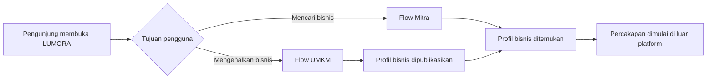
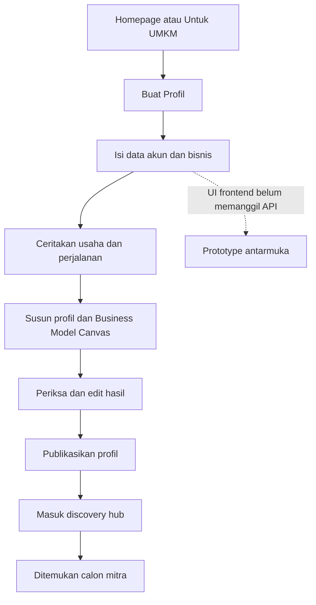
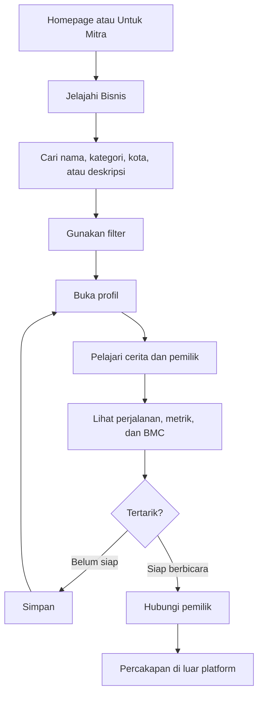
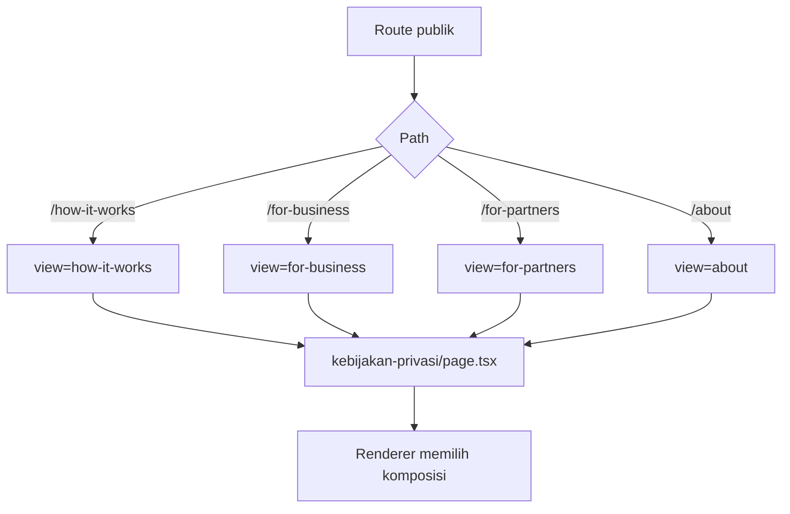
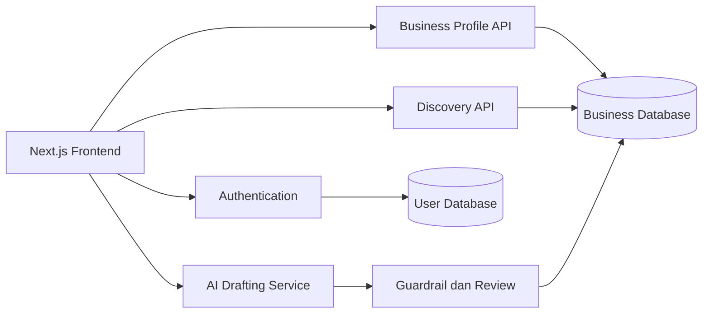

# LUMORA

**Digital Pitching + Business Discovery Platform untuk UMKM Indonesia.**

LUMORA membantu pemilik UMKM menyusun cerita, perjalanan, data sederhana, dan model bisnisnya menjadi profil digital yang mudah dipahami. Calon mitra dapat menemukan, mempelajari, menyimpan, lalu memulai percakapan dengan bisnis yang relevan.

> **Status:** backend **fase 1–11 selesai** dan sudah berjalan di Railway. Frontend masih **prototype antarmuka** — seluruh profil dan metrik bisnisnya masih data contoh di `frontend/data/businesses.ts`, dan **belum memanggil backend** (baru ada rewrite proxy yang belum dipakai).

---

## Daftar Isi

- [Tujuan Produk](#tujuan-produk)
- [Struktur Repositori](#struktur-repositori)
- [Fitur](#fitur)
- [Flow Produk](#flow-produk)
- [Route Frontend](#route-frontend)
- [Teknologi](#teknologi)
- [Menjalankan Proyek](#menjalankan-proyek)
- [Arsitektur Backend](#arsitektur-backend)
- [Arsitektur Frontend](#arsitektur-frontend)
- [Data dan State](#data-dan-state)
- [Design System](#design-system)
- [SEO dan Aksesibilitas](#seo-dan-aksesibilitas)
- [Status dan Keterbatasan](#status-dan-keterbatasan)
- [Referensi Dokumentasi](#referensi-dokumentasi)

## Tujuan Produk

LUMORA menjembatani dua kebutuhan utama.

### Untuk UMKM

- Menyusun informasi usaha secara bertahap.
- Mengubah cerita sederhana menjadi profil terstruktur.
- Mendokumentasikan milestone perjalanan usaha.
- Menampilkan Business Model Canvas.
- Menjelaskan kebutuhan kemitraan.
- Membuat bisnis lebih mudah ditemukan.

### Untuk calon mitra

- Menjelajahi bisnis berdasarkan nama, kategori, kota, dan deskripsi.
- Membaca konteks bisnis, bukan hanya angka.
- Memahami perjalanan dan model bisnis UMKM.
- Menyimpan profil menarik.
- Menghubungi pemilik bisnis melalui jalur yang tersedia.

LUMORA **bukan** crowdfunding, payment gateway, escrow, marketplace saham, pemberi rekomendasi investasi, atau pengganti legal due diligence.

## Struktur Repositori

```text
lumora/
├── backend/     # REST API — Go + Postgres. Aktif dikembangkan, fase 1–11 selesai.
├── frontend/    # Next.js 16 App Router — prototype antarmuka, masih mock data.
├── docs/        # api.md (kontrak endpoint), fases.md (riwayat fase + backlog),
│                # manual-test.md (smoke test + runbook produksi)
└── README.md
```

## Fitur

### Backend (sudah jalan)

- **Katalog bisnis** — list publik dengan pencarian (`q`), filter kategori & kota, paginasi; detail per slug. Hanya profil `published` yang terlihat.
- **Akun & sesi** — register, login, logout, `GET/PATCH/DELETE /auth/me`, ganti kata sandi. Sesi disimpan server-side, browser hanya membawa cookie `httpOnly`.
- **CRUD profil bisnis** — buat (selalu mulai `draft`), edit sebagian, publish, arsip. Milestone dan Business Model Canvas tersimpan transaksional bersama profilnya.
- **Bookmark per akun** — menggantikan `localStorage`, idempoten.
- **Upload media** — cover dan logo; tipe file dicek dari isi byte, bukan ekstensi.
- **Draf profil dengan AI** — narasi bebas masuk, draf profil terstruktur keluar. Tidak pernah mengarang angka finansial.
- **Verifikasi email** — link sekali-pakai 24 jam, disimpan di DB hanya sebagai hash SHA-256.
- **Rate limiting** — per akun/email plus valve global, untuk AI, login/register, dan endpoint verifikasi.
- **Logging terstruktur** — `log/slog`, JSON di produksi, `X-Request-ID` per request.

### Frontend (prototype)

- Homepage editorial: hero, masalah UMKM, featured discovery, proses tiga tahap, pratinjau LUMORA AI, showcase profil, timeline, FAQ, CTA.
- Discovery: pencarian nama/kategori/lokasi/deskripsi, filter lima kategori, empty state dinamis, grid editorial di `/explore`.
- Profil bisnis: cover, identitas, cerita, pemilik, milestone, metrik contoh, grafik enam bulan, BMC, kebutuhan kemitraan.
- Bookmark berbasis `localStorage`.
- Pratinjau LUMORA AI dengan respons lokal — **tidak** memanggil model AI.
- Halaman login/registrasi: UI dan validasi HTML saja.

## Flow Produk

### Flow utama


```mermaid
flowchart LR
    A[Pengunjung membuka LUMORA] --> B{Tujuan pengguna}
    B -->|Mengenalkan bisnis| C[Flow UMKM]
    B -->|Mencari bisnis| D[Flow Mitra]
    C --> E[Profil bisnis dipublikasikan]
    D --> F[Profil bisnis ditemukan]
    E --> F
    F --> G[Percakapan dimulai di luar platform]
```

### Flow UMKM


```mermaid
flowchart TD
    A[Homepage atau Untuk UMKM] --> B[Buat Profil]
    B --> C[Isi data akun dan bisnis]
    C --> D[Ceritakan usaha dan perjalanan]
    D --> E[Susun profil dan Business Model Canvas]
    E --> F[Periksa dan edit hasil]
    F --> G[Publikasikan profil]
    G --> H[Masuk discovery hub]
    H --> I[Ditemukan calon mitra]
    C -. UI frontend belum memanggil API .-> J[Prototype antarmuka]
```

Endpoint di balik flow ini sudah tersedia di backend (register → `POST /businesses` → `PATCH` → `POST /publish`), tetapi form frontend belum tersambung ke sana.

### Flow Mitra


```mermaid
flowchart TD
    A[Homepage atau Untuk Mitra] --> B[Jelajahi Bisnis]
    B --> C[Cari nama, kategori, kota, atau deskripsi]
    C --> D[Gunakan filter]
    D --> E[Buka profil]
    E --> F[Pelajari cerita dan pemilik]
    F --> G[Lihat perjalanan, metrik, dan BMC]
    G --> H{Tertarik?}
    H -->|Belum siap| I[Simpan]
    H -->|Siap berbicara| J[Hubungi pemilik]
    I --> E
    J --> K[Percakapan di luar platform]
```

### Flow discovery frontend

```mermaid
flowchart LR
    A[businesses.ts] --> B[BusinessDiscoveryExplorer]
    C[Input pencarian] --> B
    D[Filter kategori] --> B
    B --> E[Daftar hasil]
    E --> F[BusinessCard]
    F --> G[/business/slug]
    F --> H[Bookmark]
    H --> I[localStorage]
```

### Flow route editorial


```mermaid
flowchart TD
    A[Route publik] --> B{Path}
    B -->|/how-it-works| C[view=how-it-works]
    B -->|/for-business| D[view=for-business]
    B -->|/for-partners| E[view=for-partners]
    B -->|/about| F[view=about]
    C --> G[kebijakan-privasi/page.tsx]
    D --> G
    E --> G
    F --> G
    G --> H[Renderer memilih komposisi]
```

## Route Frontend

| Route | Halaman | Status |
|---|---|---|
| `/` | Homepage | Server page + client island |
| `/explore` | Discovery bisnis | Search, filter, bookmark lokal |
| `/business/[slug]` | Profil bisnis | Static params dari data lokal |
| `/how-it-works` | Cara Kerja | Rewrite ke renderer bersama |
| `/for-business` | Untuk UMKM | Rewrite ke renderer bersama |
| `/for-partners` | Untuk Mitra | Rewrite ke renderer bersama |
| `/about` | Tentang | Rewrite ke renderer bersama |
| `/login` | Masuk | UI saja |
| `/register` | Registrasi | UI saja |
| `/register?role=umkm` | Registrasi UMKM | UI dengan konteks role |
| `/kebijakan-privasi` | Kebijakan Privasi | Placeholder |
| `/syarat-ketentuan` | Syarat dan Ketentuan | Halaman legal |

Empat route editorial diatur melalui `rewrites()` dalam `frontend/next.config.ts`, lalu dirender oleh `frontend/app/(site)/kebijakan-privasi/page.tsx` berdasarkan query internal `view`.

## Teknologi

### Backend

- Go 1.27, module `github.com/alfian/lumora/backend`.
- Gin (HTTP), pgx/v5 (driver Postgres).
- Postgres 16 di Docker Compose; produksi Railway berjalan di Postgres 18.6.
- sqlc untuk query bertipe (schema dibaca dari `migrations/`), goose untuk migrasi.
- argon2id untuk kata sandi, `log/slog` untuk logging.
- Google Gemini sebagai provider AI, Resend (HTTPS API) sebagai pengirim email.

### Frontend

- Next.js 16 App Router, React 19, TypeScript.
- Tailwind CSS 4 via `@tailwindcss/postcss` dan `@import "tailwindcss"`.
- Vanilla CSS hanya untuk semantic token, animasi kompleks, scrollbar, dan perilaku global.
- `next/image` dan `next/font`; Inter untuk body/interface, DM Serif Display untuk heading editorial.
- ESLint 9.
- `localStorage` + `useSyncExternalStore` untuk bookmark.

## Menjalankan Proyek

### Backend (`cd backend`)

Cara tercepat — satu perintah menyalakan Postgres, migrasi, seed, lalu API:

```bash
docker compose up -d --build      # postgres → migrate → seed → api (:8080), idempoten
curl http://localhost:8080/healthz   # {"status":"ok"}
docker compose down               # data & upload tetap aman di volume
docker compose down -v            # reset total (DB fresh; migrasi + seed jalan lagi)
```

Menjalankan di host (butuh Go terpasang, Postgres tetap dari Docker):

```bash
docker compose up -d --wait       # Postgres saja
go run ./cmd/migrate              # terapkan migrasi goose
go run ./cmd/seed                 # 9 profil demo (melewati slug yang sudah ada)
go run ./cmd/api                  # http://localhost:8080
```

`backend/.env` opsional di development — defaultnya menunjuk ke DB compose. `AI_PROVIDER` default `gemini` dan **menolak start** tanpa `GEMINI_API_KEY`; set `AI_PROVIDER=stub` untuk jalan tanpa kredensial. Semua variabel didokumentasikan di `backend/.env.example`.

```bash
# Test — tidak butuh database
go test ./... -count=1
go test ./internal/service -run TestListReturnsTotalAndChildren -v

# Integration test — memukul Postgres asli, auto-skip kalau DB mati
go test -tags integration ./internal/service -run Integration -v -count=1

# Style gate (harus bersih)
gofmt -l . && go vet ./...

# Regenerate internal/store setelah mengubah queries/*.sql
sqlc generate
```

Race detector dijalankan di container karena host tanpa gcc:

```bash
MSYS_NO_PATHCONV=1 docker run --rm -v "$(pwd -W):/src" -w /src golang:1.27 go test -race ./...
```

### Frontend (`cd frontend`)

```bash
npm install
npm run dev      # http://localhost:3000
npm run lint
npm run build
npm run start
```

## Arsitektur Backend

### Alur request

`cmd/api/main.go` adalah satu-satunya titik wiring: memuat config, membuka pool pgx, menyusun service dan handler, lalu mendaftarkan seluruh route.

```text
cmd/api (wiring)  →  internal/http/handler  →  internal/service  →  internal/store (sqlc)
                            ↓                        ↓
                     internal/http/middleware   internal/domain (tipe + sentinel error)
```

- **`internal/domain`** — tipe `Business`, `User`, dan draf AI plus sentinel error (`ErrNotFound`, `ErrForbidden`, `ErrInvalidCategory`, `ErrInvalidParameter`, `ErrAIUnavailable`). `domain.Business` mencerminkan `frontend/types/business.ts` field per field (JSON camelCase); kedua daftar kategori adalah kontrak — ubah bersamaan.
- **`internal/store`** — **di-generate** sqlc dari `queries/*.sql` dengan `migrations/` sebagai schema. Jangan edit `*.sql.go` manual; ubah query lalu `sqlc generate`.
- **`internal/service`** — logika bisnis. Tiap service mendeklarasikan interface repository sempit supaya bisa dikompilasi dan dites tanpa database. Penulisan multi-statement lewat `service.Transactor` agar kegagalan di tengah tidak meninggalkan bisnis tanpa milestone/BMC-nya.
- **`internal/http/handler`** — hanya urusan HTTP. Handler mendeklarasikan interface service secara lokal supaya bisa dites dengan fake.
- **`internal/config`** — semua env dibaca dan divalidasi di `Load()`; nilai tidak valid **menggagalkan startup**, bukan degradasi diam-diam.

### Envelope error

Setiap error memakai bentuk yang sama, dan kodenya terdokumentasi lengkap di `docs/api.md`:

```json
{ "error": { "code": "not_found", "message": "Profil bisnis tidak ditemukan." } }
```

Setiap respons juga membawa header `X-Request-ID` yang di-generate server — sertakan saat melaporkan error, karena log memakai id yang sama.

### Autentikasi & sesi

- Token sesi di cookie `httpOnly` `lumora_session` (`SameSite=Lax`, `Secure` saat `APP_ENV=production`). **Tidak ada** header `Authorization`, **tidak ada** token di `localStorage`.
- Kata sandi disimpan sebagai argon2id PHC string. Login menjalankan verifikasi argon2 dummy pada jalur "email tidak ditemukan" supaya waktu respons tidak membocorkan keberadaan akun.
- Draft tidak pernah bocor ke list/detail publik. `DELETE /businesses/:id` **mengarsipkan**, bukan menghapus.
- Menghapus akun adalah satu `DELETE FROM users`: sesi, token verifikasi, bookmark, dan seluruh bisnis miliknya ikut terhapus lewat `ON DELETE CASCADE`.
- `RequireVerified()` adalah **soft gate**, hanya dipasang di dua endpoint yang menerbitkan konten atau berbiaya: `POST /businesses/:id/publish` dan `POST /ai/draft-profile`.

### Rate limiting

`internal/http/middleware/ratelimit.go` adalah token bucket in-memory — tanpa Redis, tanpa goroutine latar. Kuncinya **tidak pernah berbasis IP**: di belakang proxy Railway `ClientIP()` tidak bisa dipercaya, jadi kuncinya adalah user ID atau email di body request.

Dua aturan yang menentukan saat menambah route terbatas:

1. Valve global dipasang **sebelum** limiter per-kunci. Bucket hanya dialokasikan untuk kunci baru, jadi urutan terbalik membuat map tumbuh tanpa batas saat dibanjiri kunci berbeda.
2. Angka batas datang dari env; **jendelanya konstanta di `cmd/api/main.go`**, supaya nama env dan durasinya tidak bisa melenceng.

State reset tiap restart, dan skema ini mengasumsikan **satu instance** — volume Railway memang menghalangi replica.

### AI drafting

`internal/ai` punya dua implementasi `service.Drafter`: `gemini.go` (provider asli, default) dan `stub.go` (heuristik offline untuk run tanpa kredensial dan tes). Menambah provider = implement `service.Drafter`, tambah satu `case` di `cmd/api/main.go`, tambah satu nilai di `config.AIProviders`.

`domain.DraftProfile` sengaja **tidak punya field finansial**, jadi aturan "AI tidak boleh mengarang angka" bersifat struktural, bukan konvensi. Kegagalan provider dinormalkan menjadi satu `503 ai_unavailable`.

> Google men-retire nama model secara berkala. Kalau draf mulai membalas `503` terus, cek log API — baris `gemini: generateContent failed status=404` berarti nama modelnya basi dan bisa diganti lewat `GEMINI_MODEL` tanpa mengubah kode.

### Verifikasi email

Register membuat token 32 byte, menyimpan **hanya hash SHA-256**-nya, lalu mengirim link ke `FRONTEND_BASE_URL/verify-email?token=...`. Link sengaja menunjuk ke **frontend**, yang kemudian POST token ke API — banyak klien email dan security scanner men-prefetch URL GET, jadi verifikasi lewat GET bisa menghabiskan token sebelum user sempat klik.

`internal/email` punya dua implementasi `service.VerificationSender`: `resend.go` (provider asli via API HTTPS) dan `stub.go` (menulis link ke log). Provider memakai **HTTPS, bukan SMTP**, karena Railway memblokir SMTP keluar di bawah plan Pro. Setiap kegagalan provider runtuh menjadi `domain.ErrEmailUnavailable` → `503 email_unavailable`.

## Arsitektur Frontend

### App Router

- `app/layout.tsx`: metadata, favicon, font, bahasa, dan CSS global.
- `app/(site)/layout.tsx`: navbar, main, dan footer publik.
- `app/(site)/page.tsx`: susunan homepage.
- `app/(site)/business/[slug]/page.tsx`: detail bisnis berdasarkan slug.

### Komponen

- `components/layout`: navbar, mobile navigation, logo, footer.
- `components/business`: business card, discovery explorer, monogram, profile mockup, revenue chart.
- `components/sections`: seluruh section homepage.
- `components/ui`: button, badge, container, heading, accordion, list, journey line.

Server Component dipakai secara default. Client Component hanya untuk navbar scroll state, mobile menu, discovery, bookmark, filter homepage, dan AI preview.

## Data dan State

### Backend

Postgres, lima migrasi (`0001`–`0005`): `users`, `sessions`, `businesses`, `business_milestones`, `bmc_entries`, `bookmarks`, `email_verification_tokens`. Field bisnis 1:1 dengan `frontend/types/business.ts` (JSON camelCase). `cmd/seed` mengisi 9 profil demo; profil seed punya `owner_user_id` NULL sehingga **tidak bisa diedit atau di-publish lewat API** — hanya profil yang dibuat via `POST /businesses` yang bisa dikelola.

### Frontend

`frontend/types/business.ts` adalah kontrak tipe, `frontend/data/businesses.ts` berisi sembilan profil contoh yang dipakai di homepage, discovery, detail profil, chart, dan halaman editorial. Data ini bukan informasi bisnis terverifikasi.

Bookmark tersimpan di `localStorage` dan disinkronkan ke React melalui `useSyncExternalStore` — belum tersinkron ke server, hilang kalau storage browser dihapus. Endpoint bookmark backend sudah tersedia untuk menggantikannya.

## Design System

Token utama berada di `frontend/app/globals.css`.

| Token | Nilai | Utility utama | Fungsi |
|---|---:|---|---|
| `--lumora-forest` | `#123f32` | `bg-forest`, `text-forest` | Primary dan bidang gelap |
| `--lumora-deep-forest` | `#0b3027` | `bg-deep-forest` | Hover dan footer gelap |
| `--lumora-lime` | `#b7df68` | `bg-lime` | Aksen |
| `--lumora-ivory` | `#f5f2e9` | `bg-ivory` | Background halaman |
| `--lumora-surface` | `#fbfaf6` | `bg-surface` | Surface dan input |
| `--lumora-soft-green` | `#e7efe9` | `bg-soft-green` | Pergantian bidang halus |
| `--lumora-border` | `#d8d8cf` | `border-soft` | Border dekoratif |
| `--lumora-border-strong` | `#718079` | `border-line-strong` | Border kontrol |
| `--lumora-text` | `#14382f` | `text-ink` | Teks utama |
| `--lumora-muted` | `#66736d` | `text-muted` | Teks sekunder |
| `--lumora-accent-strong` | `#245f45` | `text-accent` | Teks aksen yang kontras |

Prinsip visual:

- Editorial publication + business directory + product interface.
- Warm off-white, forest green, dan lime terbatas.
- Whitespace serta tipografi membentuk hierarchy.
- DM Serif Display hanya untuk hero dan heading editorial terpilih; Inter untuk body, navigasi, form, filter, card UI, dan chatbot.
- Tidak memakai glassmorphism atau estetika fintech/crypto.
- Animasi hanya untuk entrance dan feedback interaksi.
- `prefers-reduced-motion` dihormati.

## SEO dan Aksesibilitas

- Metadata global dan spesifik halaman.
- Template title `%s | LUMORA`.
- Bahasa dokumen `id`.
- Heading hierarchy dan elemen semantik.
- Label dan ID pada form/control.
- Accordion native `<details>`.
- Focus-visible global.
- Target sentuh minimal sekitar 44px.
- Reduced-motion support.
- `next/image` dengan responsive `sizes`.
- Static params dan metadata dinamis profil.
- Not-found untuk slug tidak tersedia.

## Status dan Keterbatasan

### Sudah selesai

| Fase | Scope |
|---|---|
| 1 | Kontrak API, endpoint baca, seed 9 profil |
| 2 | Auth — sesi cookie `httpOnly` |
| 3 | Endpoint tulis profil (create / patch / publish) |
| 4 | Bookmark per akun |
| 5 | Upload media (`coverImage` / `logo`) |
| 6 | AI draft profil |
| 7 | Rate limiting endpoint AI (per akun + anggaran global) |
| 8 | Rate limiting login/register (per email) |
| 9 | Verifikasi email saat register |
| 10 | Hapus profil (arsip) + kelola akun |
| 11 | Provider email asli (Resend) |

### Belum selesai

**Backend:**

- **Lupa / reset kata sandi** — belum ada. Provider email sudah tersedia, jadi penghalangnya adalah alur reset itu sendiri.
- **Pulihkan profil yang diarsipkan** — `DELETE` hanya mengarsipkan; tidak ada endpoint untuk mengembalikannya.
- **Sesi statis 30 hari** — tanpa refresh token.
- **Klaim pemilik profil seed** — 9 profil demo tidak bisa dikelola via API.
- **Domain Resend belum diverifikasi** — dengan `RESEND_FROM` default (`onboarding@resend.dev`), email hanya sampai ke pemilik akun Resend. Pengguna umum tidak menerima link verifikasi; ini konfigurasi dashboard, bukan bug kode.
- **Rate limiter in-memory** — state reset saat restart dan mengasumsikan satu instance.

**Frontend:**

- Belum memanggil backend sama sekali — autentikasi, database, upload, dan AI produksi belum tersambung.
- Dashboard pemilik belum ada.
- Bookmark masih `localStorage`, belum tersinkron lintas perangkat.
- `Hubungi Pemilik` masih memakai `mailto:`.
- Dokumen kebijakan privasi masih placeholder.

### Selanjutnya

1. Tambah `frontend/lib/api.ts` (fetch wrapper, `credentials: "include"`) + rewrite proxy, lalu sambungkan form login/registrasi.
2. Ganti `data/businesses.ts` dengan `GET /businesses` di `/explore`, homepage, dan `/business/[slug]`.
3. Sambungkan bookmark ke `GET/POST/DELETE /bookmarks`.
4. Bangun dashboard pemilik di atas `GET /businesses/mine`.
5. Tambah halaman `/verify-email` dan alur reset kata sandi.
6. Verifikasi domain di Resend supaya email sampai ke pengguna umum.
7. Tambah test end-to-end dan accessibility.


```mermaid
flowchart LR
    A[Next.js Frontend] --> B[Authentication]
    A --> C[Business Profile API]
    A --> D[Discovery API]
    A --> E[AI Drafting Service]
    B --> F[(User Database)]
    C --> G[(Business Database)]
    D --> G
    E --> H[Guardrail dan Review]
    H --> G
```

## Referensi Dokumentasi

| Dokumen | Isi |
|---|---|
| `docs/api.md` | **Kontrak endpoint** — envelope error, tipe `Business`, tabel status/kode, checklist integrasi frontend |
| `docs/fases.md` | Riwayat fase backend + backlog yang masih terbuka |
| `docs/manual-test.md` | Smoke test tiap endpoint langkah demi langkah; bagian 10 adalah runbook produksi Railway |
| `CODEBUDDY.md` | Panduan arsitektur dan gotcha untuk agent/AI coding |

### Catatan pengembangan

- `frontend/lib/constants.ts` adalah sumber route; `frontend/types/business.ts` adalah kontrak tipe.
- Perbarui `BUSINESS_CATEGORIES` di frontend **dan** `domain.Categories` di backend bersamaan — keduanya satu kontrak.
- Jangan edit `backend/internal/store/*.sql.go` manual; ubah `queries/*.sql` lalu `sqlc generate`.
- Jangan commit `backend/.env` atau API key.
- Pertahankan Server Component sebagai default di frontend; `"use client"` hanya saat butuh browser API, event, atau state.
- Beri label jelas pada seluruh data contoh, dan jangan menghasilkan klaim risiko, rekomendasi, atau kelayakan investasi.
